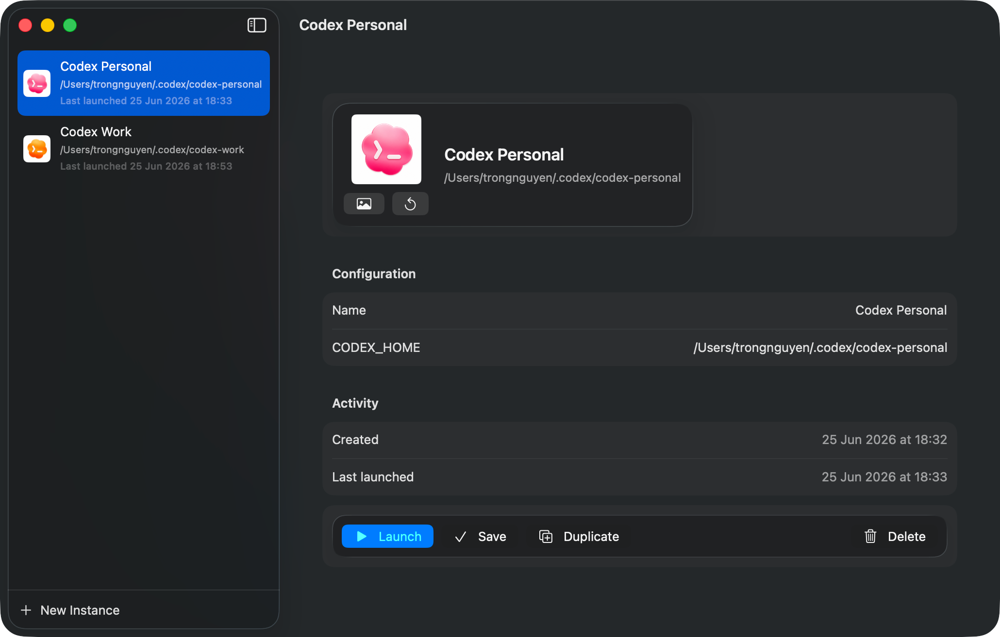

# Codex Pools

A lightweight native macOS utility for managing multiple isolated instances of
`/Applications/Codex.app`.

Each managed instance gets its own display name, icon, cloned app bundle, and
`CODEX_HOME` directory, so multiple Codex sessions can run side by side without
sharing the same home directory.

## Screenshots



## Features

- Create, edit, duplicate, and delete Codex instances.
- Persist instance configuration in `~/.config/codex-pools/instances.json`.
- Launch each instance with its own `CODEX_HOME`.
- Clone `/Applications/Codex.app` into per-instance app bundles with unique
  bundle identifiers.
- Use a custom icon per instance, including Dock/App Switcher icon resources.
- Optionally delete an instance's `CODEX_HOME` when removing it.

## Requirements

- macOS 13 or newer.
- Xcode Command Line Tools.
- `/Applications/Codex.app` installed.

## Build And Run

```bash
./script/build_and_run.sh
```

The script builds a local development app bundle at:

```text
dist/Codex Pools.app
```

Useful modes:

```bash
./script/build_and_run.sh --build-only
./script/build_and_run.sh --verify
./script/build_and_run.sh --logs
./script/build_and_run.sh --debug
```

## How It Works

Codex Pools stores instance metadata in:

```text
~/.config/codex-pools/instances.json
```

Custom icons are copied into:

```text
~/Library/Application Support/Codex Pools/Icons
```

Managed Codex app bundles are created under:

```text
~/Applications/Codex Pools
```

This keeps managed instances in a user application location that Launch Services
and Spotlight can discover more reliably than app bundles buried in Application
Support.

Launching an instance uses `NSWorkspace.OpenConfiguration` with an injected
environment:

```text
CODEX_HOME=/path/to/instance/home
CODEX_INSTANCE_ID=<instance-uuid>
```

The managed app bundle is cloned from `/Applications/Codex.app`, patched with a
unique bundle identifier/name/icon, ad-hoc signed when needed, and then opened as
a new application instance.

## Distribution Notes

The included build script produces a local development bundle with ad-hoc
signing. GitHub release artifacts are not signed with an Apple Developer
certificate and are not notarized unless you extend the workflow with your own
Apple Developer signing identity and notarization credentials.

## Installation

Download the DMG or ZIP from the latest GitHub Release.

> ⚠️ **Note**: The app is not signed with an Apple Developer certificate. If macOS blocks the app, run:
> ```bash
> xattr -cr "/Applications/Codex Pools.app"
> ```

Drag `Codex Pools.app` into `/Applications` or `~/Applications` so the manager
itself is available from Spotlight.

Managed Codex instances are installed under `~/Applications/Codex Pools` when
you launch or choose `Install/Rebuild App`. Use `Reveal App` to open the bundle
in Finder if Spotlight has not indexed it yet.

### CLI

Release builds include an optional `codex-pools-*-macos` binary. Install it by
renaming it to `codex-pools` and placing it on your `PATH`, for example:

```bash
mkdir -p ~/.local/bin
mv codex-pools-*-macos ~/.local/bin/codex-pools
chmod +x ~/.local/bin/codex-pools
```

Available commands:

```bash
codex-pools list
codex-pools launch <name-or-id>
codex-pools reveal <name-or-id>
codex-pools rebuild <name-or-id>
codex-pools path <name-or-id>
```

## CI/CD

GitHub Actions workflows are included:

- `CI`: builds the Swift package and validates the generated macOS app bundle.
- `Release`: on `v*` tags, builds `dist/Codex Pools.app`, packages DMG and ZIP
  artifacts, writes SHA-256 checksums, and publishes a GitHub Release.
  It also generates a Sparkle appcast and deploys it to GitHub Pages at
  `https://nguyenphutrong.github.io/codex-pools/appcast.xml`.
  CI and release jobs run on `macos-26` so builds use the macOS 26 SDK.

### Auto-updates

Codex Pools uses Sparkle 2 to check for updates. The app checks automatically
and asks before installing a new version. Users can also choose
`Codex Pools > Check for Updates...`.

Before publishing auto-updating releases, generate Sparkle EdDSA keys once:

```bash
swift build
generate_keys="$(find .build/artifacts -path '*/bin/generate_keys' -type f -print -quit)"
"$generate_keys"
"$generate_keys" -x sparkle_ed_private_key.txt
```

Add the printed public key as the `SPARKLE_PUBLIC_ED_KEY` GitHub Actions
secret. Store the contents of `sparkle_ed_private_key.txt` in the
`SPARKLE_ED_PRIVATE_KEY` secret, then delete the local export. Release builds
fail if either secret is missing. Local development builds omit `SUPublicEDKey`
unless `SPARKLE_PUBLIC_ED_KEY` is set in the environment.

Create and publish a release with:

```bash
git tag v0.1.0
git push origin v0.1.0
```

## License

MIT
